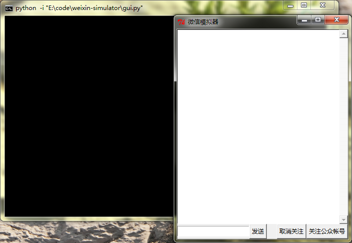

# weixin-simulator

微信公众平台没有本地调试环境，在开发时遇到了很多麻烦。写测试固然是一种方式，但维护一大批测试样例挺费神的，所以希望能有什么东西模拟微信客户端在本地与应用进行交互。求谷歌不得，于是用`tkinter`自己写了个模拟器。


## 配置
请根据需要在主文件`gui.py`中修改settings字典，最重要的是把`url`修改为相应Handler的URL。
```python
settings = {
    # `ToUserName` & `FromUserName` will be placed in the XML data posted to
    # the given URL.
    "ToUserName": "gh_bea8cf2a04fd",
    "FromUserName": "oLXjgjiWeAS1gfe4ECchYewwoyTc",

    # URL of your Wexin handler.
    "url": "http://localhost:8080/weixin",

    # These will be displayed in GUI.
    "mp_display_name": "APP",
    "me_display_name": "ME",

    # The token you submitted to Weixin MP. Used to generate signature.
    "token": ""
}
```

## 使用
完成设置后直接运行主文件`gui.py`即可。效果如下图：



点击`关注公众帐号`将模拟一位微信用户关注该公众帐号。

点击`取消关注`将模拟一位微信用户取消关注该公众帐号。

发送`c@EVENT_KEY`将模拟一位微信用户点击以`EVENT_KEY`为`EventKey`的`CLICK`类型自定义菜单选项。

发送`v@URL`将模拟一位微信用户点击以`URL`为`EventKey`的`VIEW`类型自定义菜单选项。

## 其他
功能很简单也很不完善，不过最基本的开发够用了。好在代码也很简单，请随意修改以满足自己的需求。欢迎发PR。
